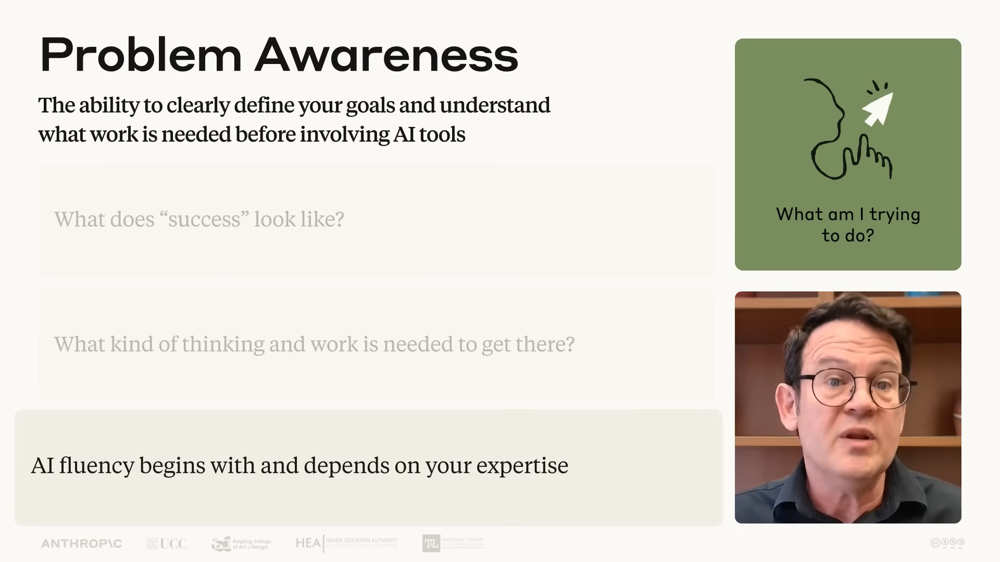
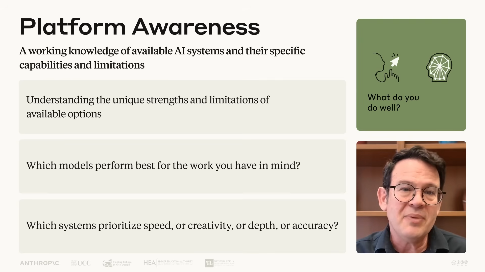
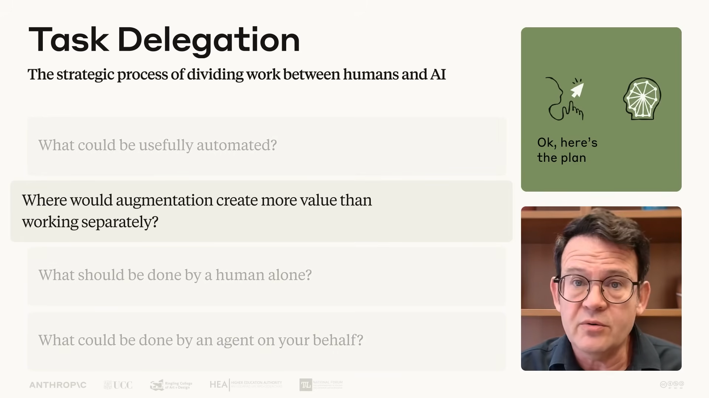

# Notes

---

## Table of Contents

- [Key Concepts](#key-concepts)
- [Questions & Clarifications](#questions--clarifications)
- [Ideas & Experiments](#ideas--experiments)
- [Resources](#resources)
- [Miscellaneous](#miscellaneous)

---

## Key Concepts
1. This course focuses on human-AI collaboration, not just understanding AI as a technology
2. AI Fluency means engaging with AI systems effectively, efficiently, ethically, and safely
3. The AI Fluency Framework centers on the "4D" competencies of Delegation, Description, Discernment and Diligence
4. The goal is to develop lasting skills that remain relevant as AI technology evolves
5. Effective AI collaboration requires both practical skills and a fundamental shift in how we think about working with AI 

Automation, Augmentation, Agency is related to engaging with AI systems effectively, efficiently, ethically, and safely.

Automation: The AI completes specific tasks based on your instructions.
Augmentation: You and AI collaborate as creative thinking and task execution partners.
Agency: You configure AI to work independently on your behalf, establishing its knowledge and behavior patterns rather than just giving it specific tasks.

### Key takeaways
* AI Fluency means engaging with AI in ways that are effective, efficient, ethical, and safe
* There are three primary ways we engage with AI:
  - Automation: AI executes specific tasks based on your instructions
  - Augmentation: You and AI collaborate as creative thinking and task execution partners
  - Agency: You guide AI to work independently on your behalf, shaping its knowledge and behavior rather than specific actions
* The AI Fluency Framework consists of four core competencies (the 4Ds):
  - Delegation: Deciding what work to do with AI vs. yourself
  - Description: Communicating effectively with AI systems
  - Discernment: Evaluating AI outputs critically
  - Diligence: Ensuring responsible AI collaboration
* These competencies apply across all three ways of working with AI
* Developing these competencies prepares you for evolving AI capabilities

## Chapter: Deep Dive 1: What is Generative AI
### Delegation Competency
[1.3 Delegation Summary](../resources/1.3_Delegation_Summary.pdf)

1. Effective, Efficient, Ethical, Safe
**Delegation** is about first two of those
- **Problem Awareness** - the ability to clearly define your goals and understand what work is needed before involving AI tools
  - What does "success" look like?
  - What kind of thinking and work is needed to get there?
  - AI fluency begins with and depends on your expertise

- **Platform Awareness** - a working knowledge of available AI systems and their specific capabilities and limitations
  - Understanding the unique strength and limitations of available options
  - Which models perform best for the work you have in mind?
  - Which systems prioritize speed, or creativity or depth or accuracy?

- **Task Delegation** - the strategic process of dividing work between humans and AI
  - What could be usefully automated?
  - Where would augmentation create more value than working separately? 
  - What should be done by a human alone?
  - What could be done by an agent on your behalf?

### Description Competency
[1.5 Description Summary](../resources/1.5_Description_Summary.pdf)

**Description** is the ability to communicate with AI in ways that create a productive collaborative environment.

- **Product Description** - defining what you want in terms of outputs, format, audience, and style
  - What does the final output look like?
  - Who is the audience and what tone/style fits?
  - What format should the response take?

- **Process Description** - defining how the AI approaches your request, such as providing step-by-step instructions for the AI to follow
  - What steps should the AI follow?
  - In what order should things be done?
  - Are there constraints or rules to apply along the way?

- **Performance Description** - defining the AI system's behavior during your collaboration, such as whether it should be concise or detailed, challenging or supportive
  - Should the AI be brief or thorough?
  - Should it challenge your thinking or support your ideas?
  - What role or persona should the AI take on?

> Clear communication with AI systems up front saves time and leads to better results.

#### Effective Prompting Techniques
[DD2 Handout: 6 Effective Prompting Techniques](../resources/DD2_Handout__6_Effective_Prompting_Techniques.pdf) | [Video: 6 Techniques for Effective Prompt Engineering](https://youtu.be/2YCaBqP8muw?si=CBnCWvS4CXu-DPtU)

- **1. Provide context** - be specific about what you want, including scope, geography, timeframe, and other relevant parameters
  - *Before:* "Tell me about climate change."
  - *After:* "Explain three major impacts of climate change on agriculture in tropical regions, with examples from the past decade."

- **2. Show examples of what "good" looks like** - providing examples helps the AI understand the pattern, style, or format you're looking for more clearly than descriptions alone
  - Give concrete before/after examples of the output style you expect
  - Especially useful for tone, format, or translation tasks

- **3. Specify output constraints** - define exactly what the result should look like
  - Specify sections, structure, length, style, color palette, responsiveness, etc.
  - *Before:* "Design me a personal art portfolio website."
  - *After:* "Create a clean, modern single-page portfolio website with these sections: Hero, About Me, Skills, Portfolio/Projects, Experience, and Contact. Make the navigation menu sticky and responsive, with hamburger menu on mobile. Use a sunset color palette and add a dark/light mode toggle."

- **4. Break complex tasks into steps** - breaking down complex tasks into clear steps guides the AI's reasoning process and ensures thorough, methodical responses
  - *Before:* "Analyze this quarterly sales data."
  - *After:* Ask the AI to: (1) identify top-performing products, (2) compare current quarter to previous, (3) highlight unusual patterns, (4) suggest possible reasons for trends

- **5. Ask it to think first** - giving the AI space to think before responding encourages more thoughtful, comprehensive answers
  - *Example:* "Before answering, please think through this problem carefully. Consider the different factors involved, potential constraints, and various approaches before recommending the best solution."

- **6. Define the AI's role** - defining the AI's role, tone, or style helps shape its approach to fit your specific needs and audience
  - *Example:* "Please explain how rainbows form from the perspective of an experienced science teacher speaking to a bright 10-year-old who's interested in science."

- **Secret Weapon: Ask the AI for help with prompting** - when you're not sure how to ask for something, the AI can help improve your prompt — perhaps the most powerful technique of all
  - *Example:* "I'm trying to get you, Claude, to help me with [goal]. I'm not sure how to phrase my request to get the best results. Can you help me craft an effective prompt for this?"

### Discernment Competency
[1.6 Discernment Summary](../resources/1.6_Discernment_Summary_16x9.pdf) | [Video: Discernment in AI Fluency](https://youtu.be/Y0KidGr9Z2Y?si=aHJ5ZoSl_gkQXL_M)

**Discernment** is the ability to thoughtfully and critically evaluate what AI produces, how it produces it, and how it behaves.

Discernment is the flip side of Description — while Description helps you communicate your intentions clearly, Discernment helps you evaluate whether what you receive meets your needs. Even the most advanced AI systems benefit from human judgment and oversight.

- **Product Discernment** - evaluating the quality of what AI produces
  - Is the output accurate and factually correct? Are there any factual errors or misconceptions?
  - Is it appropriate for the context and audience?
  - Is it coherent and logically consistent?
  - Is it relevant to what was actually asked? Is the level of detail appropriate?

- **Process Discernment** - evaluating how the AI arrived at its output
  - Are there logical errors or gaps in reasoning?
  - Did the AI lose track of key details or constraints (lapses in attention)?
  - Are the reasoning steps appropriate and sound?
  - Does the AI make appropriate connections between concepts?

- **Performance Discernment** - evaluating how the AI behaves during your interaction
  - Was the AI attentive to your specific question and responsive to feedback?
  - Is its communication style effective for your needs?
  - Is terminology used appropriately for the topic?
  - Is the tone and format working well for the task?

> Discernment works hand-in-hand with Description in a continuous feedback loop — what you observe through Discernment informs how you refine your Description.

> Your domain expertise directly enhances your Discernment — someone without subject knowledge will struggle to spot inaccuracies that an expert would catch immediately.

### Diligence Competency
[1.8 Diligence Summary](../resources/1.8_Diligence_Summary.pdf)

**Diligence** is taking responsibility for what we do with AI and how we do it.

- **Creation Diligence** - being thoughtful about which AI systems you use and how you interact with them
  - Are you using the right AI tool for this task?
  - Are you interacting with it in a responsible and intentional way?

- **Transparency Diligence** - being honest about AI's role in your work with everyone who needs to know
  - Are stakeholders, collaborators, or audiences aware that AI was involved?
  - *Example:* "In this document, Claude 3.7 was used to..."

- **Deployment Diligence** - taking responsibility for verifying and vouching for the outputs you use or share
  - Have you checked the AI's output before using or sharing it?
  - You are accountable for what you deploy, regardless of how it was generated

> Different contexts (personal, academic, professional) may have different expectations for disclosure and verification.
> Thoughtful Diligence ensures AI collaborations are not only effective and efficient, but also ethical and safe.

#### Diligence Statement
A diligence statement is a transparent acknowledgment of AI's role in your work, along with your commitment to responsibility for the final output. Add it to an appropriate location (footer, appendix, or metadata) when sharing AI-assisted work.

**Template:**
> "In creating this [document/project/content], I collaborated with [AI assistant name] to assist with [specific tasks: drafting, research, editing, etc.]. I affirm that all AI-generated and co-created content underwent thorough review and evaluation. The final output accurately reflects my understanding, expertise, and intended meaning. While AI assistance was instrumental in the process, I maintain full responsibility for the content, its accuracy, and its presentation. This disclosure is made in the spirit of transparency and to acknowledge the role of AI in the creation process."

**Key questions to reflect on before writing your statement:**
- *Creation:* Which AI systems did you use and why? What data did you share? Were there privacy or ethical considerations?
- *Transparency:* Who is your audience? What are their expectations around AI disclosure? How specifically did AI contribute?
- *Deployment:* What steps did you take to verify accuracy? How did you ensure the output meets your standards? What responsibility are you taking for the final product?

---

## Questions & Clarifications

---

## Ideas & Experiments

---

## Resources

---

## Miscellaneous
Learning Outcomes:
* A framework for thinking about AI Interaction
* The ability to make informed decisions about when and how to engage with AI systems
* Practical skills for more fluent human-AI collaboration
* Confidence in evaluating and taking responsibility for AI outputs

